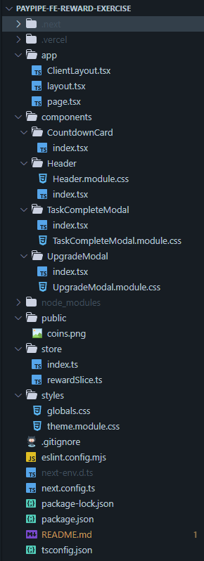

# 💰 Reward System Upgrade – Paypipe Front-End Challenge

This project is a front-end implementation of a gamified reward system upgrade flow, built using **Next.js 14**, **React**, **Redux Toolkit**, and **CSS Modules**. It’s a take-home challenge provided by Paypipe, aimed to simulate a real-world upgrade user flow with countdown logic, modals, and global reward state.

**(Vercel):** (https://vercel.com/ambras-projects-554ff293/paypipe-fe-reward-exercise)

---

## Features Implemented

### Core Functionality

- **Countdown Card with Urgency Shift**  
  - Starts at 1 minute on every page load (hardcoded).
  - Switches style to “urgent” mode when ≤ 30 seconds.

- **Upgrade Flow**
  - Clicking the card opens an **UpgradeModal**.
  - Modal displays countdown + prompt to upgrade.
  - On confirmation, adds **+40 reward points** and transitions to **TaskCompleteModal**.

- **Global State Management**
  - Reward points stored in Redux global state.
  - Accessible and updated from anywhere (e.g. header).
  - Uses Redux Toolkit’s `createSlice`.

- **Modals with Visual Backdrop**
  - Modals open in center of screen.
  - A greyed-out backdrop dims the background.
  - ESC key and click "×" button close modal.
  - (Focus trap to be implemented — see TODO)

- **Responsive Layout**
  - Works across screen sizes from **320px to 1440px**.
  - Max and min widths respected via CSS layout rules.
  - Flexible layout using percentages + `max-width`.

- **CSS Modules & Theme Variables**
  - Each component has its own `.module.css`.
  - Uses global theme variables from `theme.module.css` for consistent colors.
  - Icons used via emoji for quick prototyping.

- **SEO Metadata**
  - Implemented Next.js Metadata API in `layout.tsx`
  - Includes title, description, and OG tags.

---

## File Structure

---

## Setup Instructions

1. Clone the repo  
   `git clone https://github.com/ObieandI/paypipe-fe-reward-exercise`

2. Install dependencies  
   `npm install`

3. Start the dev server  
   `npm run dev`

4. Visit `http://localhost:3000`

---

## TODO LEFT

- [ ] Add focus trap to modals for full accessibility
- [ ] Improve modal animations (e.g. with Framer Motion)
- [ ] Add unit tests for timer logic (e.g. using Jest)

---

## Acknowledgements

Design based on Figma spec provided in the Paypipe challenge.

Built with ❤️ in ~6 hours for the front-end take-home task.

---
